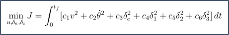
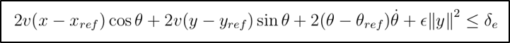
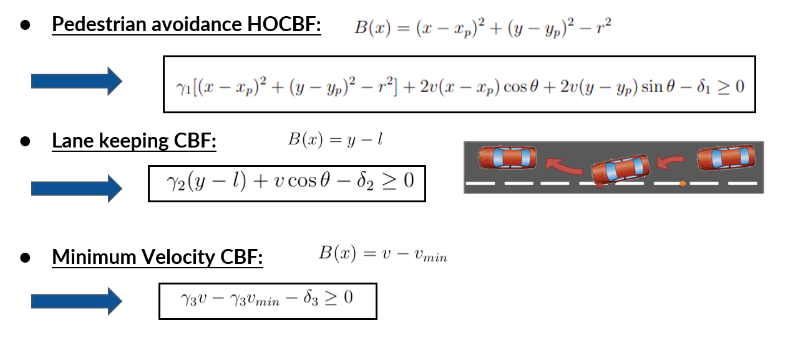
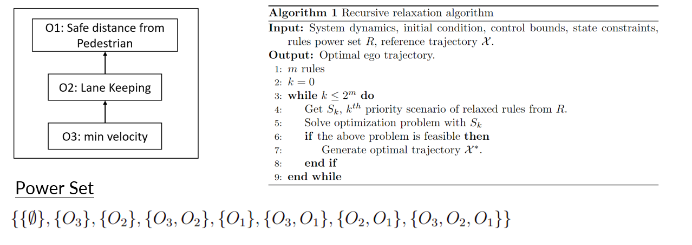
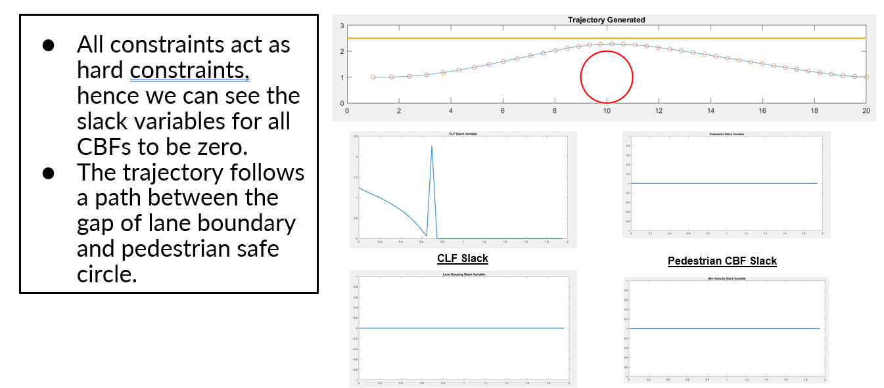
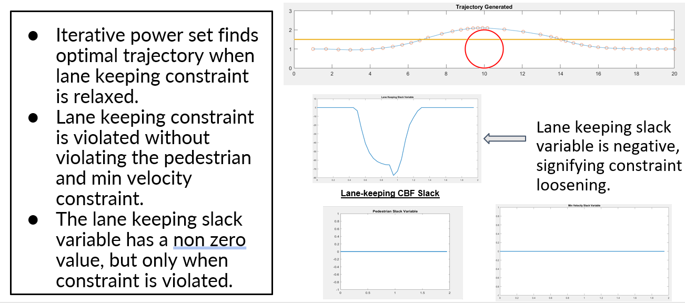
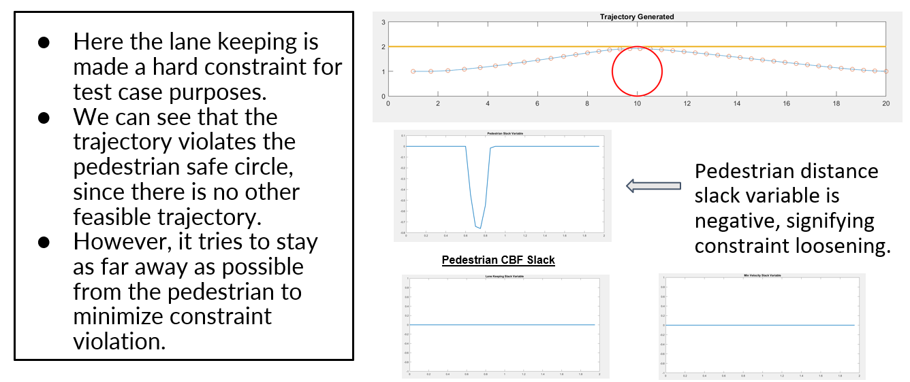
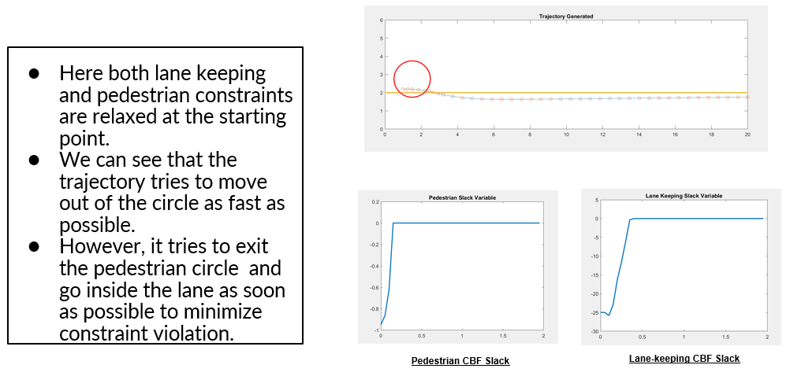

# Rule-Based-Optimal-Control
Project implements an approach for Autonomous Vehicle to navigate on the road using an optimal control technique. In this technique the constraints (Traffic Rules/Obstacles/Driving behavior) are given an priority order. The constraints are relaxed based on their priority to find the optimal trajectory.

The Project is based on Research Paper published by Motional AD LLC 
Link: https://arxiv.org/abs/2101.05709

This projects implements the core algorithm given in the paper with a few simplifications to dynamics model and modifications to optimization methods used. 

# Approach
1. Dynamics Model
2. Cost Function
3. Control Lyapunov Function (Constraints)
4. Control Barries Function (Contraints)
5. Algorithm for Optimization

# Dynamics Model
)

Model in form of affine control system

# Cost Function
)

It incorporates linear velocity, angular velocity, CLF slack variable, and 3 CBF slack variables

# Control Lyapunov Function
)

CLF is derived based on choosen Lyapunov Function. Here Lyapunov function is 2-norm of the error between states (current and reference at that time stamp)

# Control Barrier Function
)

There are 3 CBF functions for 3 constraints

# Priority Structure and Algorithm
)

We can see the priority structure of the rules(constraints).
Further in the algorithm we iterate through the power set created and find the optimal trajectory.

# Optimization
'fmincon' optimizer is used to optimize over the entire trajectory. 'fmincon' is used because of non-linear constraints involved on states.

# Results
1. Scenario 1

2. Scenario 2

3. Scenario 3

4. Scenario 4

