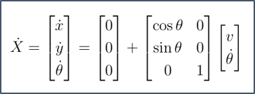

# Rule-Based-Optimal-Control
Project implements an approach for Autonomous Vehicle to navigate on the road using an optimal control technique. In this technique the constraints (Traffic Rules/Obstacles/Driving behavior) are given an priority order. The constraints are relaxed based on their priority to find the optimal trajectory.

The Project is based on Research Paper published by Motional AD LLC 
Link: https://arxiv.org/abs/2101.05709

# Approach
1. Dynamics Model
2. Cost Function
3. Control Lyapunov Function (Constraints)
4. Control Barries Function (Contraints)
5. Algorithm for Optimization

# Dynamics Model
)

